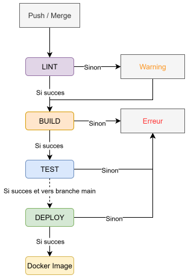

# CI/CD Documentation

## 1. Introduction and Objectives

This document describes the architecture, implementation, and configuration of the Continuous Integration and Continuous Deployment (CI/CD) pipeline for the Nutri-Check project.

The pipeline is designed for a **monorepo** containing a backend (`server`) and a frontend (`client`), with the following objectives:
* **Full Automation**: Automate quality checks, tests, builds, and application deployments.
* **Efficiency**: Only run relevant jobs based on modified files to save time and resources.
* **Reliability**: Use reproducible environments with Docker and locked dependencies.
* **Version Management**: Build and push versioned Docker images to ensure traceability and facilitate rollbacks.
* **Modularity**: Maintain a clear and scalable CI/CD configuration.

***

## 2. Pipeline Structure

The entire configuration is managed by GitHub CI/CD.

### 2.1. Pipeline Flow Diagram

The diagram below illustrates the logical flow of the pipeline for each component (client or server).

### 2.2. Stages

The pipeline is divided into four sequential stages:

1.  **`lint`**: Static analysis of code quality and style. It runs quickly and fails early if issues are found. A failure in this stage generates a warning but does not block the pipeline (`allow_failure: true`).
2.  **`build`**: Installation of dependencies and creation of artifacts required for the following stages.
3.  **`test`**: Execution of unit tests, component tests, and smoke tests.
4.  **`deploy`**: Building Docker images and deploying them to Docker Hub.

### 2.3. Configuration Files

For better organization, the configuration is split into several files:

* **`.github/workflows/server.yml`**: Contains all jobs specific to the Python backend (`lint`, `build`, `test`, `deploy`).
* **`.github/workflows/client.yml`**: Contains all jobs specific to the React frontend (`lint`, `build`, `test`, `preview`, `deploy`).

### 2.4. Intelligent Monorepo (`rules:changes`)

The core of this pipeline's efficiency relies on the `rules:changes` keyword. Each job is configured to run only if files within its scope have been modified.

* If only files in `server/` are modified, only the `server` jobs will run.
* If only files in `client/` are modified, only the `client` jobs will run.

***

## 3. Job Implementation

### 3.1. Backend (`server` - Python/FastAPI)

* **Linting**: Uses `black`, `isort`, and `mypy` via `poetry` to ensure consistent code quality.
* **Build**: `poetry install` installs dependencies into a virtual environment (`.venv`), which is then passed as an artifact to the test job.
* **Test**: `pytest` runs the unit tests. A report in `JUnit XML` format is generated for native integration into the GitLab UI.
* **Deployment**: A multi-stage `Dockerfile` is used to create an optimized production image. The `deploy` job reads the version from `pyproject.toml`, builds the Docker image, and pushes it to Docker Hub.

### 3.2. Frontend (`client` - React/Vite)

* **Linting**: `npm run lint` runs ESLint to check the TypeScript/React code.
* **Build**: `npm run build` compiles the application and generates static files in the `dist/` directory.
* **Test**:
    * `test_client`: `vitest` runs unit and component tests.
    * `preview_client`: A smoke test that uses the build artifact to start a preview server and verify that it responds correctly.
* **Deployment**: A multi-stage `Dockerfile` uses Node.js to build the static files, then Nginx to serve them in the final image. The `deploy` job reads the version from `package.json` and pushes the versioned image to Docker Hub.

***

## 4. Required Configuration

For the pipeline to work, some initial setup is required.

### 4.1. GitHub CI/CD Variables

The following variables must be configured in your project's **Settings > CI/CD > Variables**. It is crucial to mark them as **"Protected"** and **"Masked"**.

| Key | Value | Description |
| :--- | :--- | :--- |
| `DOCKER_HUB_USER` | `joopererer` | Username to log in to Docker Hub. |
| `DOCKER_HUB_TOKEN`| Your access token | Docker Hub access token (more secure than a password). |
| `SERVER_APP_NAME` | `nutri-check-server` | The name of your backend Docker image on Docker Hub. |
| `CLIENT_APP_NAME` | `nutri-check-client` | The name of your frontend Docker image on Docker Hub. |

### 4.2. Dockerfiles

Two `Dockerfile`s must exist at the following locations:
* `server/Dockerfile`: To build the backend application.
* `client/Dockerfile`: To build the frontend application.

### 4.3. Version Management

The version of each application is the source of truth for the Docker tags. It must be updated manually before a deployment:
* For the backend: in the `server/pyproject.toml` file (e.g., `version = "0.1.0"`).
* For the frontend: in the `client/package.json` file (e.g., `"version": "0.1.0"`).

### 4.4. Docker Hub Repositories

The Docker images built by this pipeline are published to the following addresses:

* **Backend (Server):** [joopererer/nutri-check-server](https://hub.docker.com/r/joopererer/nutri-check-server)
* **Frontend (Client):** [joopererer/nutri-check-client](https://hub.docker.com/r/joopererer/nutri-check-client)

***

## 5. Workflow and Triggers

The pipeline is triggered by two main types of events:

1.  **Push to a branch or Merge Request update**:
    * The `lint`, `build`, and `test` stages run for the parts of the code (`client` or `server`) that have been modified.
    * The `deploy` stage **does not run**.

2.  **Push or Merge to the default branch (`main`)**:
    * The `lint`, `build`, and `test` stages run for the modified parts.
    * If the tests pass, the `deploy` stage is triggered **only for the applications (client or server) whose code has been modified**.
    * The Docker images are built and pushed to Docker Hub.

This workflow ensures fast feedback during development on branches and a secure, efficient deployment on the main branch.