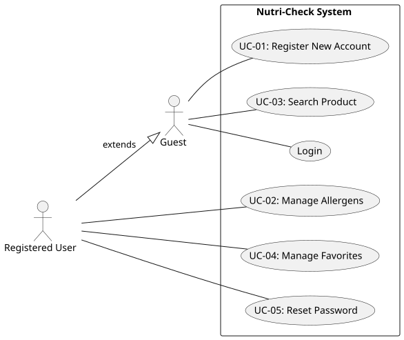
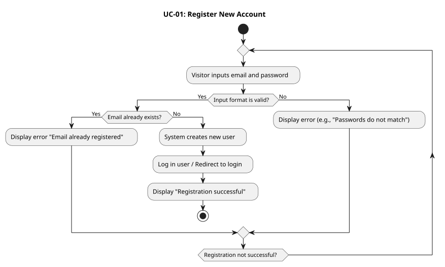
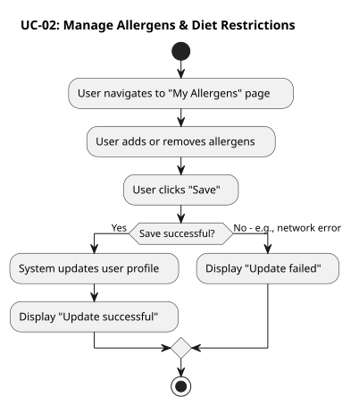
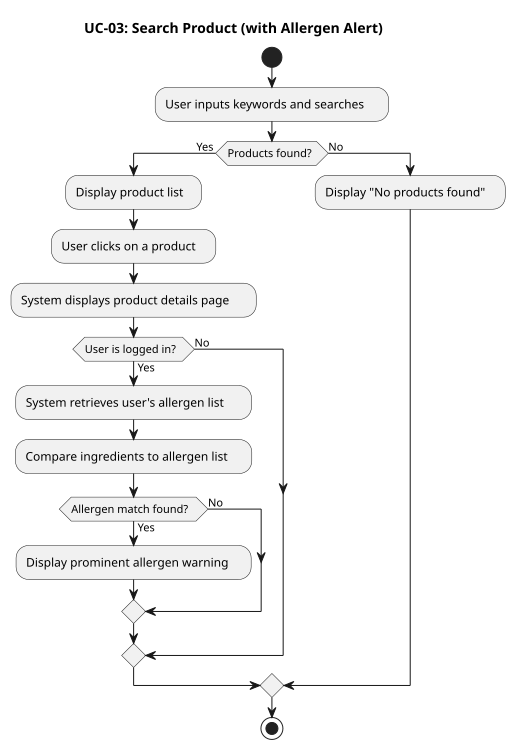
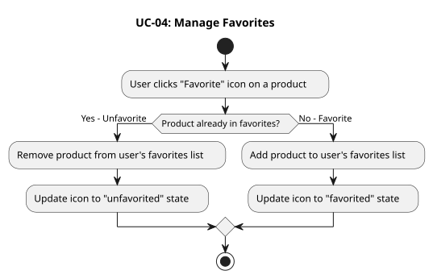
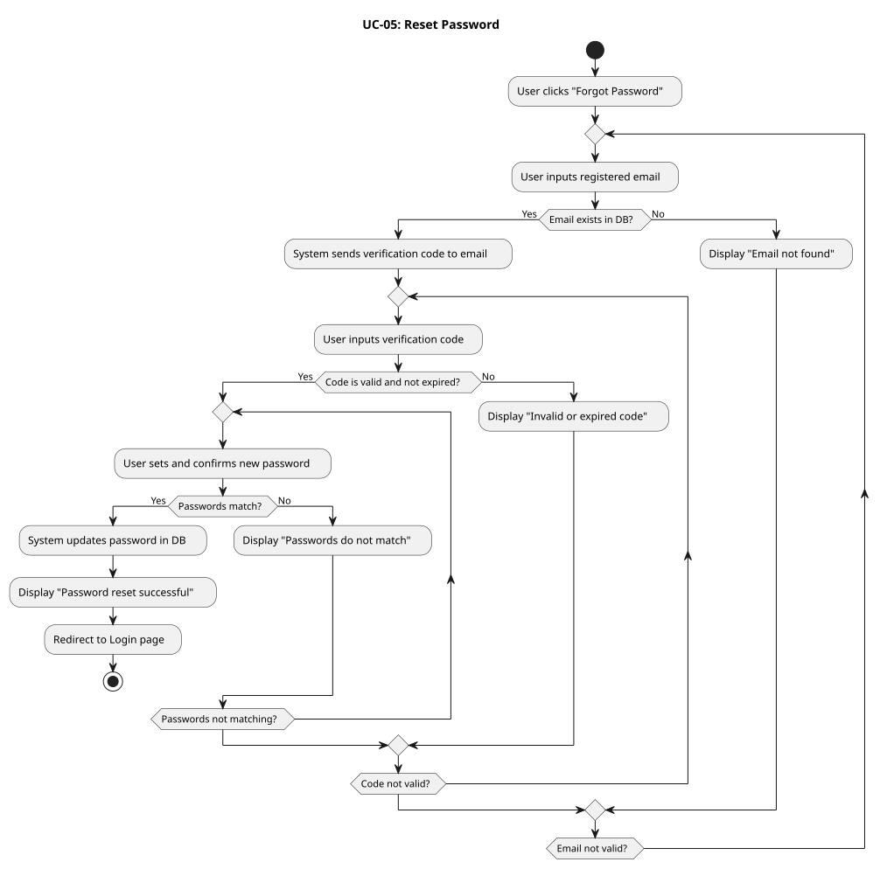

## Use Cases

### 1. Document Overview

This document defines the main functional use cases for the Nutri-Check system. It aims to clarify the system's functional scope, the actors involved, and the interactions between these actors and the system.

### 2. Actors

* **Guest:** An unauthenticated user.
* **Registered User:** An authenticated and logged-in user.
* **System:** The Nutri-Check application.

    

---

### 3. Use Case Details

#### Use Case-01: Create a New Account
* **ID:** UC-01
* **Name:** Create a New Account
* **Actor:** Guest
* **Summary:** The guest provides the necessary information (email, password) to create a new user account.
* **Preconditions:**
    * The guest is on the "Registration" page.
* **Basic Flow:**
    1.  The guest enters their email address, sets a password, and confirms the password.
    2.  The guest clicks the "Sign Up" button.
    3.  The system validates the compliance of the entered information (email format, password strength, password match).
    4.  The system checks if the email address already exists in the database.
    5.  The system creates a new user record in the database, storing the password in an encrypted format.
    6.  The system automatically logs in the user (or redirects them to the login page).
    7.  The system displays a "Registration successful" message and redirects the user to their profile or the homepage.
* **Alternative Flows:**
    * **3a. Invalid information:** The system displays an error message next to the relevant fields (e.g., "Invalid email format" or "Passwords do not match").
    * **4a. Email already exists:** The system displays an error message: "This email address is already in use, please log in".
* **Postconditions:**
    * The guest has successfully created an account and becomes a "Registered User".
    
    

#### Use Case-02: Manage Allergens and Dietary Restrictions
* **ID:** UC-02
* **Name:** Manage Allergens and Dietary Restrictions
* **Actor:** Registered User
* **Summary:** The registered user adds, views, or removes specific allergens and dietary restrictions (e.g., vegan, gluten-free) in their profile.
* **Preconditions:**
    * The user is logged in.
    * The user has navigated to the "Profile" or "My Preferences" page.
* **Basic Flow:**
    1.  The user selects the "Edit my allergens" option.
    2.  The system displays a list of common allergens/restrictions (possibly with a search function).
    3.  The user checks (adds) or unchecks (removes) the items that concern them (e.g., "Peanuts", "Dairy", "Gluten").
    4.  The user clicks the "Save" button.
    5.  The system validates and updates the user's profile record.
    6.  The system displays an "Update successful" confirmation message.
* **Alternative Flows:**
    * **5a. Save failure (e.g., network interruption):** The system displays an error message: "Could not save changes, please try again".
* **Postconditions:**
    * The user's allergy and restriction preferences are updated in the system.
    
    

#### Use Case-03: Search and View Product (with Allergen Alert)
* **ID:** UC-03
* **Name:** Search and View Product (with Allergen Alert)
* **Actor:** Guest, Registered User
* **Summary:** The user searches for a product by name. When a registered user views the details, the system compares the ingredients with their allergens and displays an alert if necessary.
* **Preconditions:**
    * The user is on a page with a search bar (e.g., Home, Products Page).
* **Basic Flow:**
    1.  The user enters keywords (product name) into the search bar.
    2.  The user clicks "Search" (or presses "Enter").
    3.  The system queries the database and returns a list of matching products (summary view).
    4.  The user clicks on a product from the list.
    5.  The system displays the detailed product page (including ingredients list, nutritional information, etc.).
    6.  **(Registered User only)** The system retrieves the user's allergen list (defined in UC-02).
    7.  **(Registered User only)** The system compares the product's ingredients list with the user's allergen list.
    8.  **(Registered User only)** If a user's allergen is detected (or potentially present) in the ingredients, the system displays a visible warning (e.g., "Warning! This product contains/may contain: [Allergen Name]").
* **Alternative Flows:**
    * **3a. No product found:** The system displays a "No product matches your search" message.
* **Postconditions:**
    * The user has viewed the product details.
    * The registered user has received a personalized warning in case of allergic risk.

    

#### Use Case-04: Manage Favorites
* **ID:** UC-04
* **Name:** Manage Favorites
* **Actor:** Registered User
* **Summary:** The user adds or removes products from their personal favorites list for quick access.
* **Preconditions:**
    * The user is logged in.
* **Basic Flow - A: Add a Favorite:**
    1.  The user is viewing a product details page (UC-03) or a product list.
    2.  The user clicks the "Favorite" icon (e.g., an empty heart) associated with the product.
    3.  The system associates this product ID with the user's account in their favorites list.
    4.  The system updates the icon to a "Saved" state (e.g., a filled heart).
* **Basic Flow - B: Remove a Favorite:**
    1.  The user is viewing a product already in favorites, or is on the "My Favorites" page.
    2.  The user clicks the "Saved" icon.
    3.  The system removes this product ID from the user's favorites list.
    4.  The system updates the icon to the "Not saved" state.
* **Basic Flow - C: View Favorites:**
    1.  The user navigates to the "My Favorites" page.
    2.  The system displays the list of all products saved by the user.
* **Postconditions:**
    * The user's favorites list is updated.

    

#### Use Case-05: Reset Password (Forgot Password)
* **ID:** UC-05
* **Name:** Reset Password (Forgot Password)
* **Actor:** Registered User (logged out)
* **Summary:** A registered user who has forgotten their password can reset it via their email address.
* **Preconditions:**
    * The user is on the "Login" page.
* **Basic Flow:**
    1.  The user clicks the "Forgot password?" link.
    2.  The system redirects to the "Reset Password" page.
    3.  The user enters the email address associated with their account.
    4.  The user clicks "Send verification code" (or "Send reset link").
    5.  The system checks if this email exists in the database.
    6.  The system generates a temporary code (or token) and sends it to that email address.
    7.  The system displays a new page asking for the received code to be entered.
    8.  The user checks their email, retrieves the code, and enters it.
    9.  The system verifies that the code is correct and has not expired.
    10. The system prompts the user to enter a new password and confirm it.
    11. After validation, the system updates the user's record in the database with the new password (encrypted).
    12. The system displays "Password reset successful" and redirects the user to the login page.
* **Alternative Flows:**
    * **5a. Email not found:** The system displays an error message: "No account is associated with this email".
    * **9a. Incorrect or expired code:** The system displays an error message and allows the user to request a new code.
* **Postconditions:**
    * The user's account password has been updated.

    

---

## User Stories
1.  As a new user, I want to be able to create an account (via email/password), so that I can save my profile information, especially my allergens.

2.  As a logged-in user, I want to be able to enter and modify the list of my allergies and dietary restrictions (e.g., "gluten", "peanuts", "vegan") in my profile, so that the application can warn me about incompatible products.

3.  As a user (logged in or not), I want to be able to search for a product by its name in the database, so that I can view its detailed sheet (ingredients, nutritional information).

4.  As a logged-in user who has defined my allergies, I want to see a visual alert (e.g., a red symbol or a message) on a product's page if it contains one or more of my allergens, so that I know immediately if this product is dangerous for me.

5.  As a logged-in user, I want to be able to add a product to a personal "Favorites" list, so that I can easily find the products I like or consume regularly.

6.  As a logged-in user, I want to be able to create a "shopping trip" list and add products to it, so that I can prepare my purchases and check the compatibility of my entire cart.

7.  As a user who has forgotten my password, I want to be able to reset my password using my email address, so that I can regain access to my account.